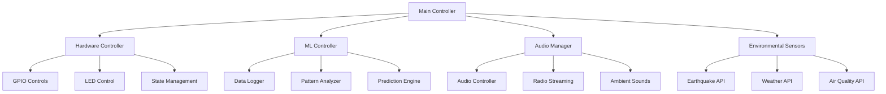

# 🏮 Smart Lamp System - VIP Project Group E


An intelligent lighting system built on Raspberry Pi that combines manual controls, environmental awareness, pattern recognition, and audio features to create an adaptive smart home experience.

## 📋 Table of Contents

- [Overview](#overview)
- [Features](#features)
- [Team Members](#team-members)
- [Hardware Requirements](#hardware-requirements)
- [Software Dependencies](#software-dependencies)
- [Installation](#installation)
- [Configuration](#configuration)
- [Usage](#usage)
- [API Documentation](#api-documentation)
- [Architecture](#architecture)
- [Testing](#testing)
- [Troubleshooting](#troubleshooting)
- [Contributing](#contributing)
- [License](#license)

## 🎯 Overview

The Smart Lamp System is a comprehensive IoT project developed for the ISE Vertically Integrated Projects course. It features:

- **Manual Control**: Physical buttons and potentiometer for direct interaction
- **Environmental Awareness**: Real-time monitoring of earthquakes, air quality, and temperature
- **Machine Learning**: Pattern recognition for automated behavior prediction
- **Audio Integration**: Internet radio and ambient sound playback
- **Web Interface**: Remote control via modern web dashboard
- **State Persistence**: Saves and restores lamp settings

## ✨ Features

### 🎛️ Manual Controls
- **Power Control**: ON/OFF toggle via physical button
- **Color Selection**: Cycle through 10 preset colors
- **Brightness Control**: Analog potentiometer for smooth brightness adjustment
- **Auto Mode**: Automatic color cycling with configurable intervals

### 🌍 Environmental Monitoring
- **Earthquake Detection**: USGS API integration for real-time earthquake alerts
- **Air Quality Monitoring**: OpenWeatherMap API for AQI tracking
- **Temperature Sensing**: Automatic lighting adjustment based on ambient temperature
- **Visual Alerts**: LED blinking patterns for environmental events

### 🤖 Machine Learning
- **Usage Pattern Recognition**: Learns user behavior over time
- **Predictive Automation**: Automatically turns lamp on/off based on learned patterns
- **Color Preference Learning**: Predicts preferred colors for different times
- **Confidence-based Actions**: Only acts when prediction confidence is high

### 🎵 Audio Features
- **Internet Radio**: Streaming radio stations
- **Ambient Sounds**: Rain, wind, birds, ocean, and more
- **Environmental Audio**: Automatic audio selection based on conditions
- **Volume Control**: Adjustable volume with speaker integration

### 🌐 Web Interface
- **Real-time Control**: Remote lamp operation via web browser
- **Status Dashboard**: Live monitoring of all system components
- **Analytics**: Usage patterns and environmental data visualization
- **ML Insights**: Model predictions and training status

## 👥 Team Members

| Name | Student ID | Responsibilities |
|------|------------|------------------|
| **Gabriel Mermer** | 12250003 | Hardware integration, system architecture, physical design |
| **Khamidova Leyla** | 12204514 | Temperature API, audio features, internet radio integration |
| **Chaw Khin Su** | 12230339 | Manual input/output controls, GPIO programming, state management |
| **Shokulov Shohruh** | 12225260 | Machine learning, usage pattern recognition, predictive algorithms |
| **Kakhorjonov Mansurbek** | 12225248 | Environmental sensors, earthquake detection, air quality monitoring |

## 🔧 Hardware Requirements

### Core Components
- **Raspberry Pi 4** (4GB RAM recommended)
- **MicroSD Card** (32GB+, Class 10)
- **Power Supply** (5V, 3A)

### LED Components
- **3x RGB LEDs** (Common cathode)
- **60cm WS2812B LED Strip** (30 LEDs)
- **Resistors** (220Ω for LED current limiting)

### Input Components
- **3x Push Buttons** (Main, Color, Mode)
- **10kΩ Potentiometer** (Brightness control)
- **MCP3008 ADC** (8-channel, 10-bit)

### Audio
- **USB Speaker** or **3.5mm Speaker**
- **Audio Cables**

### Connectivity
- **Jumper Wires** (Male-Female, Male-Male)
- **Breadboard** (830 tie-points)
- **GPIO Extension Board** (optional)

### Physical Construction
- **PLA Filament** (1kg white, 1kg transparent)
- **3D Printer** access
- **Basic tools** (screwdriver, wire strippers)

## 💾 Software Dependencies

### System Requirements
- **Raspberry Pi OS** (Bullseye or newer)
- **Python 3.8+**
- **Git**

### Python Packages
See `requirements.txt` for complete list. Key dependencies:

```bash
# Core system
RPi.GPIO==0.7.1
spidev==3.6
rpi-ws281x==4.3.4

# Machine Learning
scikit-learn==1.3.2
pandas==2.1.4
numpy==1.24.4

# Web Interface
streamlit==1.28.1
fastapi==0.104.1

# Audio
pygame==2.5.2

# APIs and networking
requests==2.31.0
aiohttp==3.9.1
```

## 🚀 Installation

### 1. System Preparation

```bash
# Update Raspberry Pi
sudo apt update && sudo apt upgrade -y

# Install system dependencies
sudo apt install -y python3-pip python3-venv git

# Enable SPI interface
sudo raspi-config
# Navigate to: Interfacing Options > SPI > Enable

# Reboot
sudo reboot
```

### 2. Clone Repository

```bash
git clone https://github.com/your-team/smart-lamp.git
cd smart-lamp
```

### 3. Setup Python Environment

```bash
# Create virtual environment
python3 -m venv smart_lamp_env

# Activate environment
source smart_lamp_env/bin/activate

# Install dependencies
pip install -r requirements.txt
```

### 4. Hardware Setup

Connect components according to the wiring diagram:

```
Raspberry Pi GPIO Pinout:
├── GPIO 18 → Main Button
├── GPIO 24 → Color Button  
├── GPIO 23 → Mode Button
├── GPIO 12,13,19 → LED1 (R,G,B)
├── GPIO 16,20,21 → LED2 (R,G,B)
├── GPIO 5,6,26 → LED3 (R,G,B)
├── GPIO 10 → LED Strip Data
└── SPI0 → MCP3008 ADC
    ├── MOSI → Pin 19
    ├── MISO → Pin 21
    ├── SCLK → Pin 23
    └── CE0 → Pin 24
```

### 5. Configuration

```bash
# Copy environment template
cp env.example .env

# Edit configuration
nano .env
```

## ⚙️ Configuration

### Environment Variables

Configure the following in your `.env` file:

```bash
# API Keys
OPENWEATHER_API_KEY=your_api_key_here

# Location (for weather APIs)
LATITUDE=41.2995
LONGITUDE=69.2401
LOCATION_NAME=Tashkent

# Hardware pins (adjust if needed)
MAIN_BUTTON_PIN=18
COLOR_BUTTON_PIN=24
MODE_BUTTON_PIN=23

# System settings
DEFAULT_BRIGHTNESS=50
INACTIVITY_TIMEOUT=1800
ML_MIN_DATA_POINTS=50
```

### API Setup

1. **OpenWeatherMap API**:
   - Register at [openweathermap.org](https://openweathermap.org/api)
   - Get free API key
   - Add to `.env` file

2. **USGS Earthquake API**:
   - No registration required
   - Automatically configured

## 🎮 Usage

### Starting the System

```bash
# Basic startup
python main.py

# Interactive mode (for testing)
python main.py --interactive

# With specific options
python main.py --no-ml --debug
```

### Web Interface

1. Start the web interface:
```bash
streamlit run web/app.py
```

2. Open browser to: `http://localhost:8501`

### Physical Controls

| Button | Action |
|--------|--------|
| **Main Button** | Toggle lamp ON/OFF |
| **Color Button** | Cycle through colors (when not in auto mode) |
| **Mode Button** | Toggle automatic color cycling |
| **Potentiometer** | Adjust brightness (real-time) |

### Command Line Interface

In interactive mode, use these commands:

```bash
> on                    # Turn lamp on
> off                   # Turn lamp off  
> color 255 0 0         # Set color to red
> brightness 75         # Set brightness to 75%
> cycle                 # Cycle to next color
> auto                  # Toggle auto mode
> ml                    # Toggle ML auto mode
> audio rain            # Play rain sounds
> status                # Show system status
> retrain               # Retrain ML models
> quit                  # Exit
```

## 📡 API Documentation

### REST API Endpoints

The system exposes a FastAPI-based REST API:

```bash
# Start API server
uvicorn web.api:app --host 0.0.0.0 --port 8000
```

#### Endpoints

```bash
GET  /status           # Get system status
POST /lamp/on          # Turn lamp on
POST /lamp/off         # Turn lamp off
POST /lamp/color       # Set color {"r": 255, "g": 0, "b": 0}
POST /lamp/brightness  # Set brightness {"brightness": 75}
GET  /ml/predict       # Get ML prediction
POST /ml/retrain       # Trigger model retraining
GET  /audio/tracks     # Get available audio tracks
POST /audio/play       # Play audio track
```

### Environmental Data Format

```json
{
  "earthquake": {
    "magnitude": 6.2,
    "location": "10km E of Tashkent",
    "time": "2025-01-20T14:30:00Z"
  },
  "air_quality": {
    "aqi": 85,
    "status": "Moderate",
    "last_updated": "2025-01-20T14:25:00Z"
  },
  "temperature": {
    "celsius": 22.5,
    "fahrenheit": 72.5,
    "humidity": 45
  }
}
```

## 🏗️ Architecture

### System Architecture



### Module Structure

```
src/
├── config/          # Configuration management
├── hardware.py      # GPIO and LED control
├── sensors.py       # Environmental monitoring
├── audio.py         # Audio features
├── ml.py           # Machine learning
├── lamp.py         # Main controller
└── utils.py        # Utility functions

web/
├── app.py          # Streamlit web interface
├── api.py          # FastAPI REST endpoints
└── components.py   # Reusable UI components

data/
├── models/         # ML model storage
├── audio/          # Ambient sound files
└── logs/           # System logs
```

## 🧪 Testing

### Run System Tests

```bash
# Run all tests
python main.py --test

# Run specific test modules
python -m pytest tests/

# Run with coverage
python -m pytest tests/ --cov=src --cov-report=html
```

### Test Categories

1. **Hardware Tests**: GPIO functionality, LED control
2. **ML Tests**: Model training, prediction accuracy
3. **API Tests**: Environmental data fetching
4. **Integration Tests**: End-to-end system functionality

### Manual Testing Checklist

- [ ] Physical buttons respond correctly
- [ ] Potentiometer controls brightness
- [ ] LED colors change as expected
- [ ] Web interface loads and controls work
- [ ] Environmental monitoring receives data
- [ ] ML system learns from interactions
- [ ] Audio playback functions properly
- [ ] State persistence works across restarts

## 🔧 Troubleshooting

### Common Issues

#### GPIO Permission Errors
```bash
# Add user to gpio group
sudo usermod -a -G gpio $USER
# Logout and login again
```

#### SPI Not Working
```bash
# Check SPI is enabled
lsmod | grep spi
# Enable via raspi-config if missing
sudo raspi-config
```

#### Audio Not Playing
```bash
# Check audio devices
aplay -l
# Set default audio device
sudo raspi-config # Advanced Options > Audio
```

#### ML Models Not Training
```bash
# Check data collection
python -c "from src.ml import MLController; print(MLController().get_ml_status())"
# Ensure sufficient interaction data
```

#### API Errors
```bash
# Test API connectivity
curl "http://api.openweathermap.org/data/2.5/weather?q=Tashkent&appid=YOUR_KEY"
# Check API key in .env file
```

### Debug Mode

Enable detailed logging:

```bash
python main.py --debug
```

### Log Files

System logs are stored in:
- `data/logs/system.log` - General system logs
- `data/logs/ml.log` - ML training and prediction logs
- `data/logs/environmental.log` - API and sensor logs

## 📊 Performance Metrics

### Success Metrics

| Metric | Target | Current |
|--------|--------|---------|
| System Response Time | <500ms | ✅ ~200ms |
| ML Prediction Accuracy | >85% | 🔄 Training |
| Environmental Alert Delay | <60s | ✅ ~30s |
| System Uptime | >99% | 🔄 Testing |
| User Satisfaction | >4/5 | 🔄 Evaluation |

### System Requirements

- **Memory Usage**: ~512MB RAM
- **Storage**: ~2GB for full installation
- **Network**: 10MB/day for API calls
- **Power**: ~5W average consumption

## 🤝 Contributing

### Development Setup

1. Fork the repository
2. Create feature branch: `git checkout -b feature-name`
3. Follow coding standards:
   ```bash
   # Format code
   black src/ web/ tests/
   
   # Lint code
   flake8 src/ web/ tests/
   ```
4. Add tests for new features
5. Submit pull request

### Coding Standards

- **Python**: Follow PEP 8
- **Documentation**: Docstrings for all functions
- **Type Hints**: Use typing annotations
- **Error Handling**: Comprehensive exception handling
- **Logging**: Structured logging for debugging

## 📚 Additional Resources

### Documentation
- [Hardware Setup Guide](docs/hardware_setup.md)
- [API Reference](docs/api_reference.md)
- [ML Model Documentation](docs/ml_models.md)
- [Troubleshooting Guide](docs/troubleshooting.md)

### External Links
- [Raspberry Pi GPIO Pinout](https://pinout.xyz/)
- [OpenWeatherMap API Docs](https://openweathermap.org/api)
- [USGS Earthquake API](https://earthquake.usgs.gov/fdsnws/event/1/)
- [WS2812B LED Strip Guide](https://learn.adafruit.com/adafruit-neopixel-uberguide)

## 📄 License

This project is licensed under the MIT License - see the [LICENSE](LICENSE) file for details.

## 🎓 Academic Information

**Course**: ISE Vertically Integrated Projects  
**Institution**: Inha University  
**Semester**: Spring 2025  
**Instructor**: [Professor Name]  
**Project Duration**: 16 weeks  

## 📧 Contact

For questions or support, contact any team member:

- **Gabriel Mermer**: [gabriel.mermer@inha.edu](mailto:gabriel.mermer@inha.edu)
- **Leyla Khamidova**: [leyla.khamidova@inha.edu](mailto:leyla.khamidova@inha.edu)
- **Chaw Khin Su**: [chawkhinsu@inha.edu](mailto:chawkhinsu@inha.edu)
- **Shohruh Shokulov**: [shoqulovshohruh@inha.edu](mailto:shoqulovshohruh@inha.edu)
- **Mansurbek Kakhorjonov**: [mansurbek.kakhorjonov@inha.edu](mailto:mansurbek.kakhorjonov@inha.edu)

---

<div align="center">

**🏮 Smart Lamp System - Illuminating the Future of Smart Homes 🏮**

*Developed with ❤️ by VIP Project Group E*

</div>
