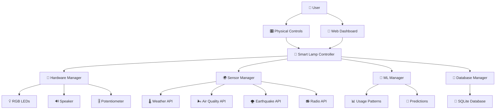

# 🏮 Smart Lamp - VIP Project 2025

<div align="center">


**An intelligent IoT lamp system with environmental monitoring, machine learning, and web-based control**

[🚀 Quick Start](#-quick-start) • [📖 Documentation](#-features) • [🎮 Demo](#-web-dashboard) • [👥 Team](#-team)

</div>

---

## 📋 Table of Contents

- [🌟 Project Overview](#-project-overview)
- [✨ Features](#-features)
- [🏗️ System Architecture](#️-system-architecture)
- [🚀 Quick Start](#-quick-start)
- [⚙️ Installation](#️-installation)
- [🔧 Configuration](#-configuration)
- [📱 Web Dashboard](#-web-dashboard)
- [🤖 Machine Learning](#-machine-learning)
- [🛠️ Hardware Setup](#️-hardware-setup)
- [📊 API Integration](#-api-integration)
- [🧪 Testing](#-testing)
- [📚 Usage Examples](#-usage-examples)
- [🔍 Troubleshooting](#-troubleshooting)
- [👥 Team](#-team)
- [📄 License](#-license)

---

## 🌟 Project Overview

The **Smart Lamp** is an innovative IoT project developed for the **Vertically Integrated Projects (VIP)** course. It combines hardware control, environmental monitoring, machine learning, and web-based interfaces to create an intelligent lighting system that adapts to user preferences and environmental conditions.

### 🎯 What Makes It Smart?

- **🧠 Machine Learning**: Learns user patterns and automatically adjusts lighting
- **🌍 Environmental Awareness**: Responds to weather, air quality, and earthquakes
- **📱 Web Control**: Beautiful dashboard for monitoring and control
- **🎛️ Manual Controls**: Physical buttons and potentiometer for direct interaction
- **📊 Data Analytics**: Comprehensive logging and pattern analysis
- **🌐 API Integration**: Real-time data from multiple environmental sources

---

## ✨ Features

### 🔧 Hardware Features
- **RGB LED Control** - Individual LEDs + addressable LED strip
- **Physical Controls** - Power, color, and mode buttons
- **Brightness Control** - Potentiometer with real-time adjustment
- **Audio Alerts** - Speaker for earthquake and air quality warnings
- **Raspberry Pi** - Main controller with GPIO interface

### 🌍 Environmental Monitoring
- **🌡️ Weather Tracking** - Real-time temperature and humidity
- **🌬️ Air Quality** - AQI monitoring with health alerts
- **🌪️ Earthquake Detection** - USGS earthquake alerts (magnitude ≥5.5)
- **📻 Internet Radio** - Streaming audio with multiple stations

### 🤖 Machine Learning
- **📈 Pattern Recognition** - Learns user ON/OFF patterns
- **🎨 Color Preferences** - Predicts favorite colors by time of day
- **⏰ Timing Prediction** - Knows when you typically use the lamp
- **🎯 Auto-Adjustment** - Applies learned preferences automatically

### 📱 Web Dashboard
- **Real-time Control** - Turn ON/OFF, change colors, adjust brightness
- **Environmental Data** - Live weather, air quality, earthquake monitoring
- **ML Insights** - 24-hour predictions and usage analytics
- **System Monitoring** - Database stats, resource usage, health checks

---

## 🏗️ System Architecture



---

## 🚀 Quick Start

### 🎮 Try the Demo (No Hardware Required)

Want to see the Smart Lamp in action? Try our web demo first!

```bash
# Clone the repository
git clone https://github.com/your-team/smart-lamp.git
cd smart-lamp

# Install basic dependencies
pip install streamlit plotly pandas

# Run the web demo
streamlit run web/app.py
```

🌐 **Open your browser to:** `http://localhost:8501`

> 💡 **Demo Mode**: The web interface works perfectly without any hardware, showing realistic demo data!

---

## ⚙️ Installation

### 📋 Prerequisites

- **Python 3.8+** (Recommended: Python 3.10)
- **Raspberry Pi 4** (for hardware features)
- **Internet Connection** (for API features)

### 🐍 Python Environment Setup

1. **Create Virtual Environment**
   ```bash
   # Create virtual environment
   python -m venv smart_lamp_env
   
   # Activate virtual environment
   # On Linux/Mac:
   source smart_lamp_env/bin/activate
   # On Windows:
   smart_lamp_env\Scripts\activate
   ```

2. **Clone Repository**
   ```bash
   git clone https://github.com/your-team/smart-lamp.git
   cd smart-lamp
   ```

3. **Install Dependencies**
   ```bash
   # Install all required packages
   pip install -r requirements.txt
   ```

### 🍓 Raspberry Pi Setup (Optional)

For full hardware functionality:

```bash
# Enable SPI and GPIO
sudo raspi-config
# Navigate to Interface Options → SPI → Enable
# Navigate to Interface Options → GPIO → Enable

# Reboot
sudo reboot
```

---

## 🔧 Configuration

### 🔐 Environment Setup

1. **Create Configuration File**
   ```bash
   # Copy example configuration
   cp .env.example .env
   ```

2. **Edit Configuration**
   ```bash
   # Open configuration file
   nano .env
   ```

3. **Required API Keys**
   
   Add your API keys to the `.env` file:

   ```bash
   # OpenWeatherMap API (Free)
   # Get your key at: https://openweathermap.org/api
   OPENWEATHER_API_KEY=your_api_key_here
   
   # Location Settings
   LOCATION_LAT=37.5665    # Seoul, South Korea
   LOCATION_LON=126.9780
   LOCATION_CITY=Seoul
   ```

### 🔧 Hardware Pin Configuration

If using different pins, update these in `.env`:

```bash
# RGB LED Pins
RGB_LED_1_RED_PIN=18
RGB_LED_1_GREEN_PIN=19
RGB_LED_1_BLUE_PIN=20

# Button Pins
POWER_BUTTON_PIN=2
COLOR_BUTTON_PIN=3
MODE_BUTTON_PIN=4

# LED Strip Pin
LED_STRIP_PIN=12
LED_STRIP_COUNT=60
```

### 🎯 ML and Behavior Settings

```bash
# Machine Learning
ML_LEARNING_PERIOD_DAYS=7          # Learning period before predictions
ML_PREDICTION_ACCURACY_THRESHOLD=0.75

# Environmental Thresholds
EARTHQUAKE_MIN_MAGNITUDE=5.5       # Minimum earthquake magnitude for alerts
BAD_AIR_THRESHOLD=100              # AQI threshold for air quality alerts
COLD_TEMPERATURE_THRESHOLD=18      # Temperature thresholds for color changes
HOT_TEMPERATURE_THRESHOLD=28
```

---

## 📱 Web Dashboard

### 🌐 Starting the Web Interface

```bash
# Run the complete system (recommended)
python main.py

# Or run just the web interface
streamlit run web/app.py --server.port 8501
```

### 📊 Dashboard Features

| Page | Features |
|------|----------|
| 🎛️ **Lamp Controls** | Power ON/OFF, Color picker, Brightness slider, Mode switching, Color presets |
| 🌍 **Environmental** | Weather data, Air quality monitoring, Earthquake alerts, Radio stations |
| 🤖 **ML & Patterns** | Usage predictions, 24-hour forecasts, Pattern analysis, Model training |
| 💻 **System Info** | Database stats, Resource monitoring, Configuration display, Maintenance tools |

### 📱 Mobile-Friendly

The dashboard is fully responsive and works great on:
- 💻 Desktop computers
- 📱 Smartphones
- 📟 Tablets

---

## 🤖 Machine Learning

### 📚 Learning Process

1. **📊 Data Collection** (Week 1)
   - Records every user interaction
   - Logs ON/OFF events with timestamps
   - Tracks color preferences and brightness

2. **🧠 Pattern Analysis** (After 1 week)
   - Analyzes usage patterns by hour and day
   - Identifies color preferences for different times
   - Builds predictive models using SVM

3. **🎯 Auto-Adjustment** (Ongoing)
   - Predicts when lamp should be ON/OFF
   - Suggests colors based on time patterns
   - Continuously improves with new data

### 📈 ML Features

- **🕐 Time-based Predictions**: Knows your daily routine
- **🌈 Color Learning**: Remembers your favorite colors
- **📊 Confidence Scoring**: Only acts when predictions are reliable
- **🔄 Continuous Learning**: Gets smarter over time

---

## 🛠️ Hardware Setup

### 🔌 Required Components

| Component | Quantity | Purpose |
|-----------|----------|---------|
| Raspberry Pi 4 | 1 | Main controller |
| RGB LEDs | 3 | Individual color lights |
| LED Strip (WS2812B) | 1 (60 LEDs) | Ambient lighting |
| Push Buttons | 3 | Power, Color, Mode control |
| Potentiometer | 1 | Brightness control |
| MCP3008 ADC | 1 | Analog input conversion |
| Speaker | 1 | Audio alerts |
| Resistors | Various | Current limiting |
| Breadboard/PCB | 1 | Circuit assembly |
| Jumper Wires | Many | Connections |

### 🔧 Wiring Diagram

```
Raspberry Pi GPIO Pinout:
┌─────────────────────────┐
│ 3V3  5V  │  5V  GND    │
│ GPIO2    │  GPIO3      │
│ GPIO4    │  GND        │
│ ...      │  ...        │
└─────────────────────────┘

RGB LED 1: Red→GPIO18, Green→GPIO19, Blue→GPIO20
RGB LED 2: Red→GPIO21, Green→GPIO22, Blue→GPIO23  
RGB LED 3: Red→GPIO24, Green→GPIO25, Blue→GPIO26
LED Strip: Data→GPIO12
Buttons: Power→GPIO2, Color→GPIO3, Mode→GPIO4
Speaker: →GPIO13
MCP3008: CLK→GPIO11, MISO→GPIO9, MOSI→GPIO10, CS→GPIO8
```

### 🏗️ Assembly Tips

1. **🔒 Safety First**: Always disconnect power when wiring
2. **📏 Resistors**: Use appropriate resistors for LEDs (220Ω recommended)
3. **🔌 Connections**: Secure all connections to prevent loose wires
4. **🧪 Testing**: Test each component individually before final assembly

---

## 📊 API Integration

### 🌍 Environmental APIs

| API | Purpose | Data |
|-----|---------|------|
| **🌪️ USGS Earthquake** | Earthquake monitoring | Magnitude, location, time |
| **🌡️ OpenWeatherMap** | Weather data | Temperature, humidity, conditions |
| **🌬️ OpenWeatherMap** | Air quality | AQI, PM2.5, NO2, O3 levels |
| **📻 Radio Browser** | Internet radio | Station list, streaming URLs |

### 🔑 Getting API Keys

1. **OpenWeatherMap** (Required for weather/air quality)
   - Visit: https://openweathermap.org/api
   - Sign up for free account
   - Get API key from dashboard
   - Add to `.env` file

2. **USGS Earthquake** (No key required)
   - Uses public USGS earthquake feed
   - No registration needed

3. **Radio Browser** (No key required)
   - Public radio station database
   - No authentication needed

---

## 🧪 Testing

### 🔧 Setup Verification

Run the setup script to verify everything is configured correctly:

```bash
python setup.py
```

This will check:
- ✅ Python dependencies
- ✅ Configuration files
- ✅ API connectivity
- ✅ Hardware simulation
- ✅ Database initialization

### 🎮 Manual Testing

1. **Hardware Test** (Raspberry Pi only)
   ```bash
   python src/hardware.py
   ```

2. **Sensor Test**
   ```bash
   python src/sensors.py
   ```

3. **ML Test**
   ```bash
   python src/ml.py
   ```

4. **Web Interface Test**
   ```bash
   streamlit run web/app.py
   ```

### 🐛 Debug Mode

For detailed logging during development:

```bash
python main.py --debug
```

---

## 📚 Usage Examples

### 🎯 Basic Usage

```bash
# Start the complete system
python main.py

# Check system status
curl http://localhost:8501/health

# Run in background
nohup python main.py &
```

### 🎛️ Manual Control Examples

The lamp automatically responds to:
- **🔴 Power Button**: Toggle ON/OFF
- **🌈 Color Button**: Cycle through colors (Manual mode)
- **⚙️ Mode Button**: Switch between Manual/Auto modes
- **🎚️ Potentiometer**: Adjust brightness in real-time

### 🌍 Environmental Responses

- **🌡️ Temperature Changes**: Automatically adjusts color tone
  - Cold (< 18°C): Warm orange tones
  - Hot (> 28°C): Cool blue tones
  
- **🌬️ Air Quality Alerts**: Changes color based on AQI
  - Good (0-50): Green
  - Moderate (51-100): Yellow
  - Unhealthy (101-150): Orange
  - Dangerous (150+): Red

- **🌪️ Earthquake Alerts**: Flashes red and sounds alarm for magnitude ≥5.5

### 🤖 ML Automation

After 1 week of usage:
- **⏰ Smart Timing**: Automatically turns ON/OFF based on your routine
- **🎨 Color Prediction**: Suggests colors based on time of day
- **📊 Usage Analytics**: Shows your lighting patterns and trends

---

## 🔍 Troubleshooting

### ❓ Common Issues

<details>
<summary><strong>🔴 "RuntimeError: This module can only be run on a Raspberry Pi!"</strong></summary>

**Solution**: This is normal when running on non-Raspberry Pi systems. The system automatically detects this and runs in simulation mode.

```bash
# This will work on any system with demo data
streamlit run web/app.py
```
</details>

<details>
<summary><strong>🌐 "API request failed" errors</strong></summary>

**Solution**: Check your API configuration in `.env`:

1. Verify your OpenWeatherMap API key is correct
2. Check internet connection
3. Verify location coordinates are valid

```bash
# Test API connectivity
python -c "from src.sensors import SensorManager; s = SensorManager(); s.check_weather()"
```
</details>

<details>
<summary><strong>💾 Database errors</strong></summary>

**Solution**: Recreate the database:

```bash
# Delete existing database
rm data/smart_lamp.db

# Run setup again
python setup.py
```
</details>

<details>
<summary><strong>🔌 Hardware not responding</strong></summary>

**Solution**: Check wiring and permissions:

1. Verify all connections are secure
2. Check pin assignments in `.env`
3. Ensure SPI/GPIO are enabled on Raspberry Pi

```bash
# Check GPIO permissions
ls -l /dev/gpiomem

# Enable SPI if needed
sudo raspi-config
```
</details>

### 📧 Getting Help

If you encounter issues:

1. **📖 Check the logs**: `tail -f logs/smart_lamp.log`
2. **🔧 Run diagnostics**: `python setup.py`
3. **📱 Check web interface**: Open `http://localhost:8501`
4. **💬 Contact team**: See team members below

---

## 🚀 Advanced Usage

### 🐳 Docker Deployment (Optional)

```bash
# Build Docker image
docker build -t smart-lamp .

# Run container
docker run -p 8501:8501 -v /dev:/dev --privileged smart-lamp
```

### ☁️ Cloud Deployment

The system can be deployed to cloud platforms for remote access:

```bash
# Example: Deploy to Heroku
heroku create smart-lamp-demo
git push heroku main
```

### 📊 Custom Dashboards

Create custom visualizations by extending the web interface:

```python
# Add custom charts in web/app.py
def render_custom_analytics(self):
    # Your custom analytics code here
    pass
```

---

## 👥 Team

<div align="center">

### **Group E - VIP Smart Lamp Team**

| Team Member | Student ID | Role | Responsibilities |
|-------------|------------|------|------------------|
| **Gabriel Mermer** | 12250003 | 🏗️ **Project Lead & Hardware** | System architecture, hardware design, integration |
| **Khamidova Leyla** | 12204514 | 🌡️ **Environmental & Audio** | Temperature monitoring, audio features, soundscapes |
| **Chaw Khin Su** | 12230339 | 🎛️ **Hardware Controls** | Manual input/output, GPIO control, physical interface |
| **Shokulov Shohruh** | 12225260 | 🤖 **Machine Learning** | Pattern recognition, user behavior analysis, predictions |
| **Kakhorjonov Mansurbek** | 12225248 | 🌍 **Sensor Integration** | API integration, earthquake/air quality monitoring |

**📧 Contact**: shoqulovshohruh@inha.edu


## 🔮 Future Enhancements

- **📱 Mobile App**: Native iOS/Android applications
- **🏠 Smart Home Integration**: Google Home, Alexa compatibility
- **☁️ Cloud Analytics**: Advanced data processing and insights
- **🎵 Music Sync**: LED synchronization with music beats
- **🗣️ Voice Control**: Voice commands for hands-free operation
- **🌐 Multi-Lamp Network**: Control multiple lamps simultaneously

---

## 📄 License

This project is licensed under the **MIT License** - see the [LICENSE](LICENSE) file for details.

```
MIT License

Copyright (c) 2025 VIP Smart Lamp Team

Permission is hereby granted, free of charge, to any person obtaining a copy
of this software and associated documentation files (the "Software"), to deal
in the Software without restriction, including without limitation the rights
to use, copy, modify, merge, publish, distribute, sublicense, and/or sell
copies of the Software, and to permit persons to whom the Software is
furnished to do so, subject to the following conditions:

The above copyright notice and this permission notice shall be included in all
copies or substantial portions of the Software.
```

---

## 🙏 Acknowledgments

- **🏫 Inha University** - VIP Program support
- **🍓 Raspberry Pi Foundation** - Excellent hardware platform  
- **🌐 OpenWeatherMap** - Environmental data APIs
- **🌪️ USGS** - Earthquake monitoring data
- **🎨 Streamlit** - Beautiful web interface framework
- **🤖 scikit-learn** - Machine learning capabilities

---

<div align="center">

### 🏮 **Smart Lamp - Lighting the Future with Intelligence**

**Made with ❤️ by Group E | VIP Project 2025 | Inha University**

[](https://github.com/your-team/smart-lamp)
[](https://github.com/your-team/smart-lamp)

[🚀 **Try the Demo**](http://localhost:8501) | [📖 **Documentation**](#-table-of-contents) | [🐛 **Report Issues**](https://github.com/your-team/smart-lamp/issues)

</div>

---

*🎓 This project was developed as part of the Vertically Integrated Projects (VIP) course at Inha University, demonstrating the integration of IoT, machine learning,